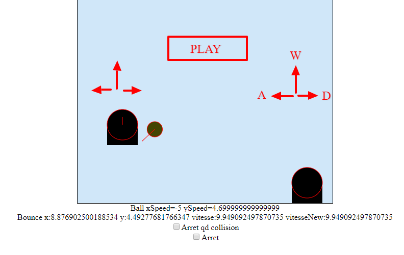

# Bubble

Bubble game was an HTML5 game experimentation.  
2 players can move and jump to interacte with the ball.  
Some physics was done to make the players jump/move and the ball bounce.  
It doesn't use any library. Project finished in 2012-09-04.

[Play it](https://htmlpreview.github.io/?https://github.com/remmel/bubble/blob/master/index.html)

